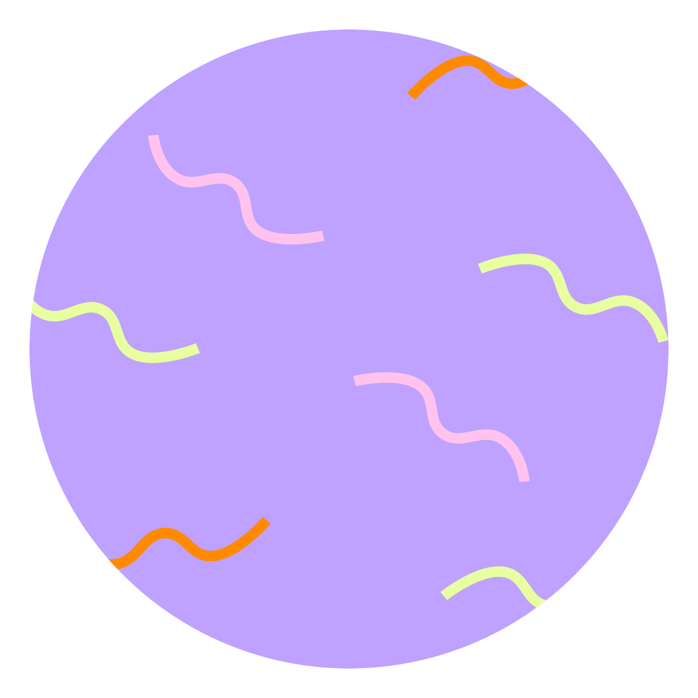

<!-- AUTO-GENERATED-CONTENT:START (STARTER) -->
<p align="center">
  
</p>

# Humans in the Wild<br/>Landing Page Starter Kit


----

### 🧐 What's inside?

A quick look at the files and directories you'll focus on

```
    .
    ├── config
    |       - Google Fonts
    |       - Local Fonts
    |       - Manifest
    |       - Metadata
    |       - Scripts
    |       - Styles
    |       - Theme
    ├── content
    |       - Header
    |       - Navigation
    |       - Hero
    |       - Callout 1
    |       - Callout 2
    |       - Callout 3
    |       - Callout 4
    |       - Conversion
    |       - Footer
    |       - Success
    ├── src ** Danger Zone **
    ├── static
    |       - Fav Icon
    |       - Images
    |       - Fonts
    |       - Videos
    └── ...
```

### Landing Page Configuation

####  **`/config`**
This directory contains site-wide configuration.

####  **`/config/google-fonts.js`**
Add Google Fonts here and use them in `theme.css`

####  **`/config/local-fonts.css`**
Define `@font-face` definitions here that reference font files stored in `/static/fonts/` and use them in `theme.css`

####  **`/config/manifest.js`**
For native-app-like behavior (Progress Web App), similarly to SEO, customize this to affect how your landing page behaves on some mobile devices when using "Add to Homescreen".

####  **`/config/metadata.js`**
For SEO, set the landing page title, description, and more.

####  **`/config/styles.css`**
Add custom styles here

####  **`/config/styles.css`**
Add custom javascript here

####  **`/config/theme.css`**
Apply colors, fonts, sizing, and more for the landing page. This uses CSS Variables to apply styles across the landing page.

### Landing Page Content

####  **`/content`**
This directory contains content for the blocks on the page. The content is formated in [Markdown](https://www.markdownguide.org/basic-syntax/) and accepts some HTML as well.

####  **`/content/Header.md`**
- Hide / Show the Header Block

####  **`/content/Navigation.md`**
- Add / Remove Navigation Links
- Hide / Show Navigation inside Header Block

####  **`/content/Hero.md`**
- Hide / Show Hero Block

####  **`/content/Callout1.md`**
- Hide / Show Callout Block

####  **`/content/Callout2.md`**
- Hide / Show Callout Block

####  **`/content/Callout3.md`**
- Hide / Show Callout Block

####  **`/content/Callout4.md`**
- Hide / Show Callout Block

####  **`/content/Conversion.md`**
- Hide / Show Conversion Block
- This is the Mailchimp Form
- Replace the built-in form with anything else

####  **`/content/Footer.md`**
- Hide / Show Footer Block

####  **`/content/Logo.md`**
- Hide / Show Logo
- Set Logo Image File

####  **`/content/Success.md`**
- Content for Success Page
- Set Redirect Behavior

### Landing Page Source Code

#### **`/src`**
Danger Zone. This directory contains all of the code for pulling in your content and applying functionality to it. `src` is a convention for “source code”. Make advanced changes in here or no changes at all!

### Landing Page Static Files

#### **`/static`**
This directory contains *images*, *videos*, *fonts*, and the fav icon. Replace any "starter kit" assets with your own. Make sure they have the same case-sensitive file names!

## 🎓 Powered by Gatsby

These landing pages are built using the Gatsby framework. For a deeper dive into the source code and underlying framework, find full documentation for Gatsby here, [on the website](https://www.gatsbyjs.org/). Here are some places to start:

- **For most developers, we recommend starting with our [in-depth tutorial for creating a site with Gatsby](https://www.gatsbyjs.org/tutorial/).** It starts with zero assumptions about your level of ability and walks through every step of the process.

- **To dive straight into code samples, head [to our documentation](https://www.gatsbyjs.org/docs/).** In particular, check out the _Guides_, _API Reference_, and _Advanced Tutorials_ sections in the sidebar.
